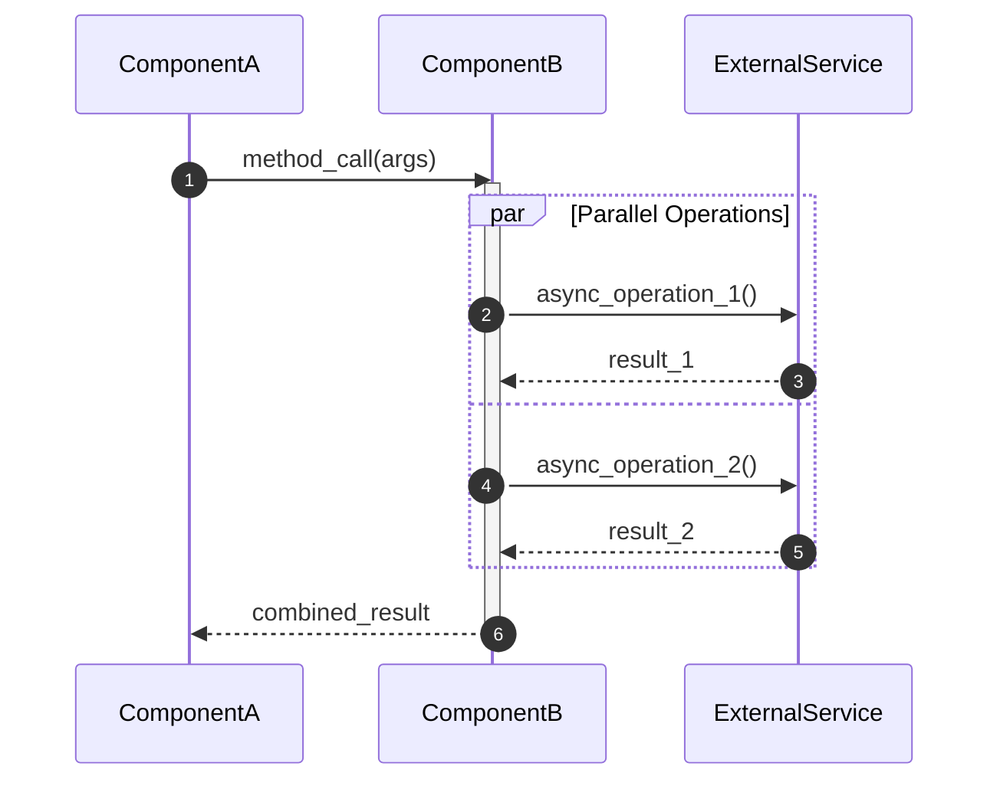
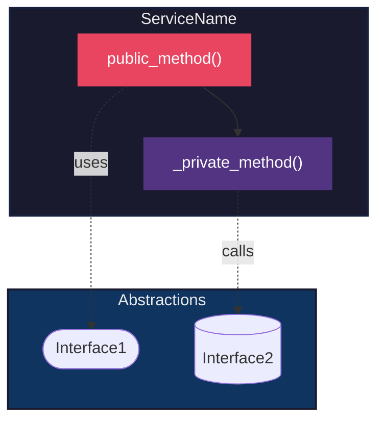

# Mermaid Diagrams Skill

This skill provides patterns and best practices for creating high-quality Mermaid diagrams that accurately document software architecture.

## When to Use

- Creating C4 zoom-in diagrams for services
- Documenting sequence flows with parallel execution
- Visualizing component dependencies
- Building flowcharts for decision logic

## Diagram Types

### 1. Sequence Diagrams (Temporal Flow)

Best for showing **how** components interact over time.

**Key elements:**

- `autonumber`: Adds step numbers for reference
- `activate/deactivate`: Shows component lifecycle
- `par/and/end`: Visualizes parallel execution
- `Note over X`: Adds contextual annotations

### 2. Flowchart (Component Diagram)

Best for showing **static dependencies** between components.

**Key elements:**

- `subgraph`: Groups related components
- `direction TB/LR`: Controls flow direction
- `-.->`: Dashed arrows for dependencies
- `style`: Custom colors per node

### 3. C4 Container Diagram

For high-level system architecture:

```mermaid
flowchart TB
    subgraph System["System Boundary"]
        subgraph Layer1["Presentation Layer"]
            UI[Web UI]
            CLI[CLI Tool]
        end

        subgraph Layer2["Service Layer"]
            SVC[Core Service]
        end

        subgraph Layer3["Data Layer"]
            DB[(Database)]
            Cache[(Cache)]
        end
    end

    UI --> SVC
    CLI --> SVC
    SVC --> DB
    SVC --> Cache

    %% Layer colors
    style Layer1 fill:#2d3436,stroke:#636e72
    style Layer2 fill:#0984e3,stroke:#74b9ff
    style Layer3 fill:#00b894,stroke:#55efc4
```

## Styling Guidelines

### Color Palette (Dark Theme)

| Layer           | Fill      | Stroke    | Text      |
| --------------- | --------- | --------- | --------- |
| Container       | `#1a1a2e` | `#16213e` | `#eaeaea` |
| Interfaces      | `#0f3460` | `#1a1a2e` | `#eaeaea` |
| Public Methods  | `#e94560` | `#1a1a2e` | `#fff`    |
| Private Methods | `#533483` | `#1a1a2e` | `#fff`    |
| External        | `#0f4c75` | `#1b262c` | `#bbe1fa` |

### Node Shapes

| Shape     | Syntax      | Use Case                |
| --------- | ----------- | ----------------------- |
| Rectangle | `[Label]`   | Methods, components     |
| Stadium   | `([Label])` | Interfaces              |
| Cylinder  | `[(Label)]` | Databases, repositories |
| Circle    | `((Label))` | Entry/exit points       |
| Hexagon   | `{{Label}}` | Decision nodes          |

## Best Practices

1. **Match the code**: Use actual method/class names from the implementation
2. **Show parallelism**: Use `par` blocks for concurrent operations
3. **Layer by abstraction**: Group by architectural layer (UI, Service, Data)
4. **Consistent styling**: Apply the same color scheme across all diagrams
5. **Add context**: Use `Note` annotations for non-obvious logic
6. **Test rendering**: Verify in [mermaid.live](https://mermaid.live) before committing

## Documentation Template

When documenting a service, include:

1. **Responsibility**: One-paragraph description of the component's role
2. **Sequence Diagram**: For the primary use case flow
3. **Component Diagram**: For static dependencies
4. **Method Table**: Key methods with brief descriptions

## Verification Checklist

- [ ] Diagram renders without errors in Mermaid preview
- [ ] All node names match actual code identifiers
- [ ] Parallel operations are properly visualized
- [ ] Colors are consistent with the project palette
- [ ] Arrows correctly show dependency direction
