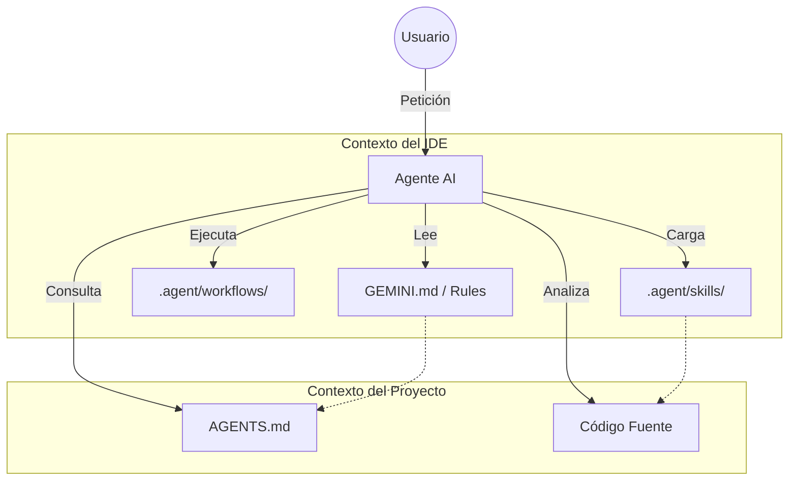
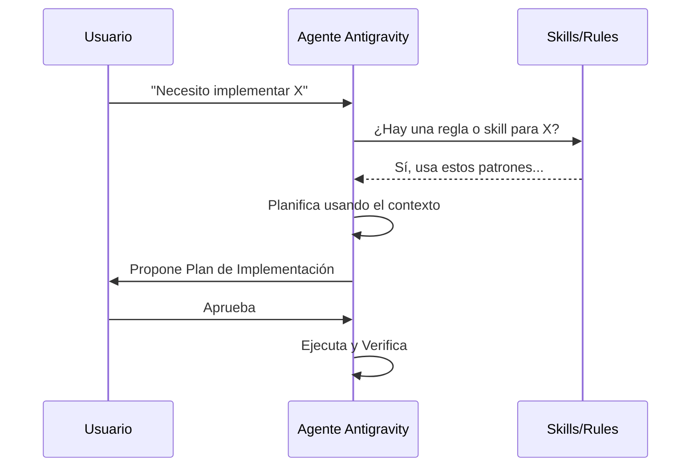

# 🤖 AI-Assisted Programming Framework (Antigravity Optimized)

Este framework está diseñado para crear un entorno de desarrollo asistido por IA de alto rendimiento, siguiendo el estándar `AGENTS.md` y optimizado específicamente para las capacidades de **Google Antigravity**, manteniendo compatibilidad con otros IDEs (Claude Code, Cursor, Copilot).

---

## 🏗️ Arquitectura del Sistema

El sistema utiliza una estructura de "Capas de Contexto" para que la IA entienda desde las reglas generales del proyecto hasta habilidades técnicas específicas bajo demanda.



---

## 📂 Componentes Principales

### 1. `AGENTS.md` (El Estándar Abierto)

Ubicado en la raíz, es el "README para máquinas". Define quién es el agente, el stack tecnológico y las normas generales. Es compatible con cualquier herramienta de IA.

### 2. Directorio `.agent/` (Optimización Antigravity)

Contiene la configuración nativa que hace que Antigravity sea "especial":

- **`/rules`**: Reglas críticas que el agente siempre debe seguir (estilo de código, arquitectura).
- **`/skills`**: "Superpoderes" modulares. Cada carpeta tiene un `SKILL.md` que enseña al agente a hacer algo específico (ej: crear nuevas skills, testear APIs).
- **`/workflows`**: Pasos estructurados para tareas complejas. Aparecen en el menú de "Customizations" de Antigravity.

### 3. `GEMINI.md` (Visibilidad UI)

Antigravity utiliza este archivo en la raíz para mostrar las reglas en el panel de **Customizations**. Actúa como el motor de instrucciones del sistema para este workspace.

---

## 🚀 Cómo usar el Sistema

### Paso 1: Inicialización

Si acabas de clonar el repo o quieres configurar el soporte para otros IDEs, ejecuta:

```bash
./scripts/setup-agents.sh
```

Esto creará los enlaces simbólicos necesarios para que las reglas de Antigravity funcionen también en **Claude Code** y **GitHub Copilot**.

### Paso 2: Ver Customizaciones en Antigravity

Si no ves las reglas o flujos de trabajo en el IDE:

1.  Presiona `Ctrl+Shift+P` (Command Palette).
2.  Escribe **"Developer: Reload Window"** y selecciónalo.
3.  Ve al panel lateral del Agente, haz clic en los **tres puntos (...)** > **Customizations**.

### Paso 3: Crear nuevas Habilidades

El sistema es auto-expandible. Usa el workflow incluido:

1.  En la terminal del IDE, puedes invocar el asistente y pedirle: _"Usa el workflow create-skill para añadir una habilidad de [nombre]"_.
2.  O usa la skill directamente: _"Usa skill-creator para configurar una nueva competencia"_.

---

## 🔄 Sincronización Automática

Cada vez que añadas una nueva Skill en `.agent/skills/`, ejecuta:

```bash
./scripts/sync-skills.sh
```

Este script actualizará la tabla de referencia en `AGENTS.md` para que cualquier agente (aunque no sea Antigravity) sepa que esa nueva habilidad existe y dónde leerla.

---

## 🛠️ Flujo de Trabajo Recomendado



---

> [!TIP] > **Edita `GEMINI.md`** para añadir instrucciones globales que quieras que el agente recuerde siempre, como "Nunca borres comentarios" o "Escribe siempre en español".
