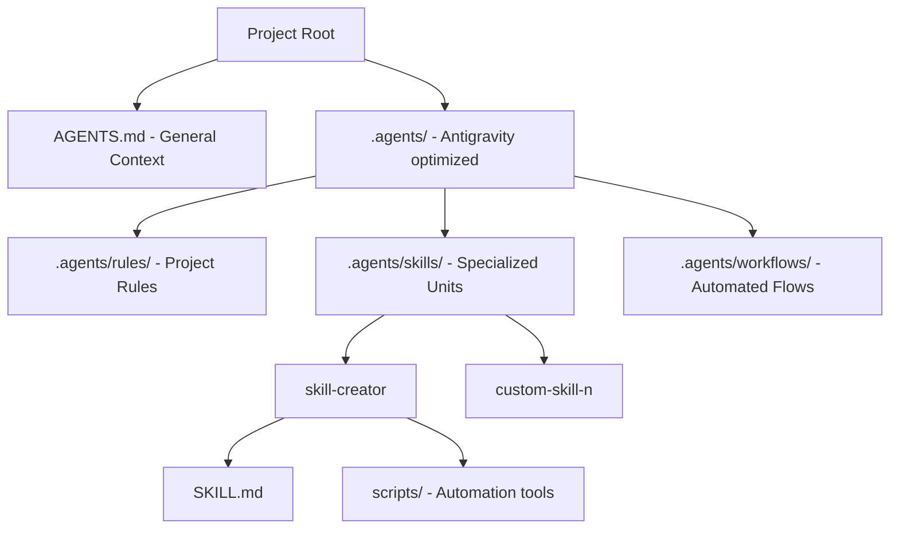

# AI-Assisted Programming Framework Design

This framework is designed to bridge the gap between general agent standards (`AGENTS.md`) and Antigravity-specific optimizations.

## Architecture

## Key Features

- **Centralized Source of Truth**: All behavioral guidance is version-controlled.
- **Multi-IDE Compatible**: Works natively in Antigravity while providing support for others via `AGENTS.md`.
- **Automated Sync**: A script ensures that as new generic skills are added, they are correctly indexed and referenced.
- **Agent Self-Creation**: Agents can use the `skill-creator` skill to expand their own capabilities within the project boundaries.
